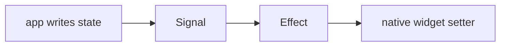

# Integrating rui

This page is for someone wiring rui into a UI library — a La Pavoiserie backend,
or anything else that renders.

## The contract

rui asks for nothing. It has no renderer interface to implement, no node type to
provide, no target define to set. A platform library uses it by **creating
effects that write to native widgets**:



That is the entire integration surface. What differs between backends is only
*how much* sits inside one effect.

## Choosing the granularity

**Coarse** — one effect around the whole view. A write re-runs the view function
and the result is diffed against the previous tree:

```haxe
new Effect(() -> {
    var tree = app.body();
    if (mounted) reconcile(tree) else mount(tree);
});
```

Simple, and it matches a declarative `body():View` contract where the app hands
back plain values. This is what `qui.App` does for the `mui`-shaped API.

**Fine** — one effect per reactive binding. A write re-applies exactly that one
property, with no tree walk and no diff:

```haxe
new Effect(() -> label.text = "Count: " + count.value);
```

`qui` does this for its own authoring syntax: each reactive property in the
markup becomes its own effect, and lists get an effect that re-reconciles only
themselves. On-device, adding an item re-runs the list's effect while the
surrounding view is never touched.

Both live side by side in one library — the granularity is a property of *how
the effects are created*, not of rui.

## Backing a `State<T>` with a signal

Most libraries expose their own state cell. Backing it with a signal is the
whole job:

```haxe
class State<T> {
    var _sig:Signal<T>;

    public function new(initial:T) _sig = new Signal(initial);

    public function get():T return _sig.value;   // tracked
    public function set(v:T):Void _sig.value = v;
    public function peek():T return _sig.peek(); // untracked
}
```

Reads inside the render effect now subscribe it automatically, and writes
re-run it. Nothing in the app code changes.

### If the platform has its own reactive primitive

Some targets already have one — a Compose `MutableState`, a SwiftUI `@State`, a
listener list, a dirty flag. Keep **one** source of truth: the signal. Mirror it
outward from an effect, and route writes coming back *from* the platform through
a silent path that updates the signal without echoing back to the platform.
Otherwise a write bounces between the two.

## Interpreted targets

rui is plain Haxe, so it runs interpreted. `qui` loads it under the CPPIA
interpreter on a Sailfish device, with signals and effects driving compiled Qt
widgets across the boundary.

One constraint worth knowing if you do the same: the interpreted guest can only
call what the compiled host exports, so rui's classes must be force-referenced
in the host, and **adding a member to a class the guest already uses requires
rebuilding the host**.

## Scope: what rui deliberately does not do

- **No rendering.** No VNode, no reconciler, no renderer contract.
- **No component model.** No base class, no `@:state` macro — each library
  defines its own authoring surface and lowers it onto effects.
- **No scheduling policy beyond batching.** See the flush note in
  [Signals & Effects](signals.md#scheduler).

The original epikDX extraction did carry a virtual DOM, a component macro, a DOM
renderer and a networking layer. Nothing consumed them, and the component macro
was still hard-wired to `epikowa.epikUI`, so they were removed rather than
maintained as dead weight. They remain in the repository's git history. A shared
render model, if one comes, will be designed against the backends' real needs
rather than inherited.
